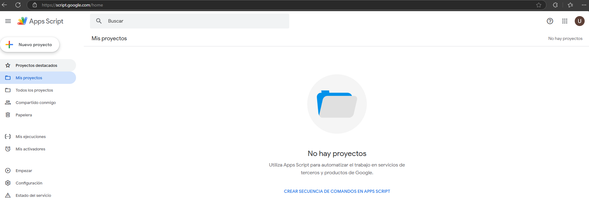
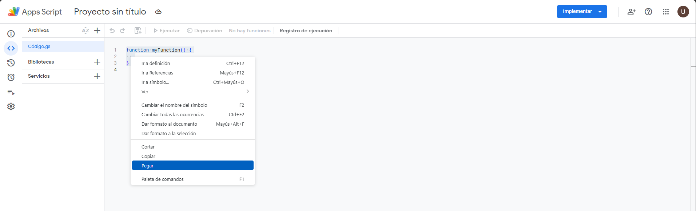
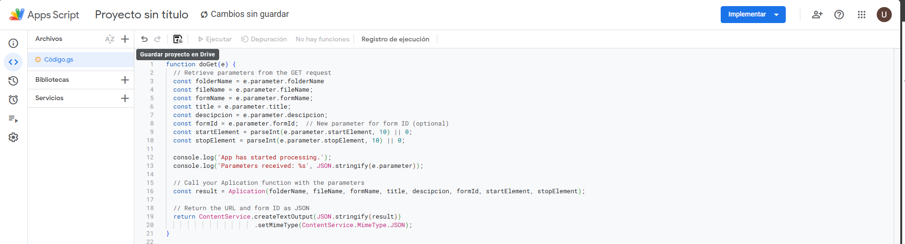
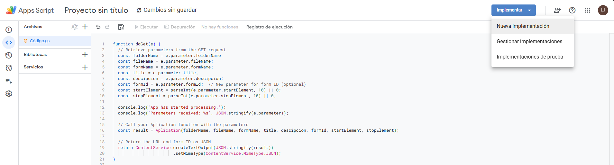
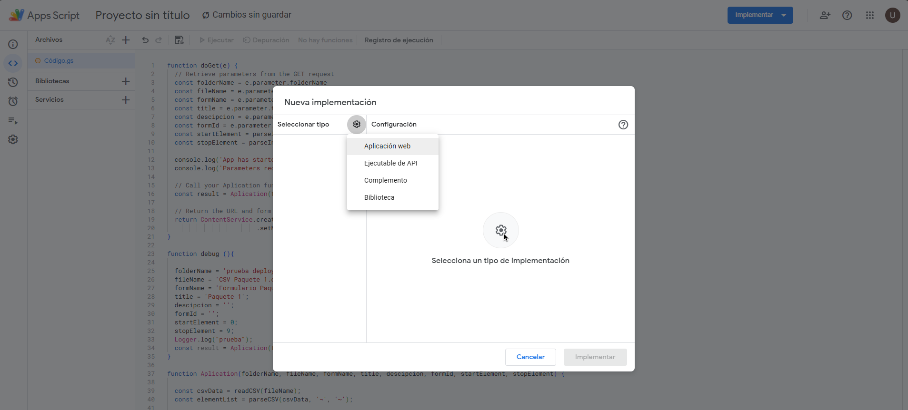
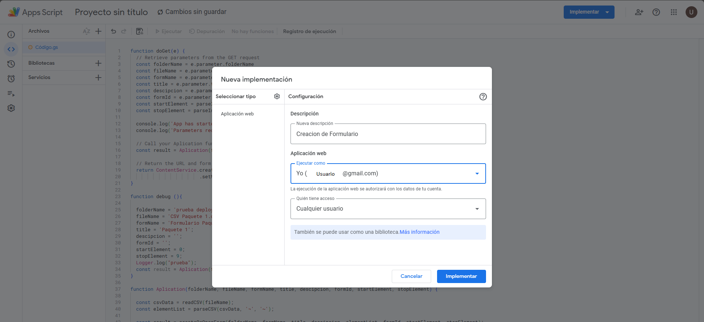
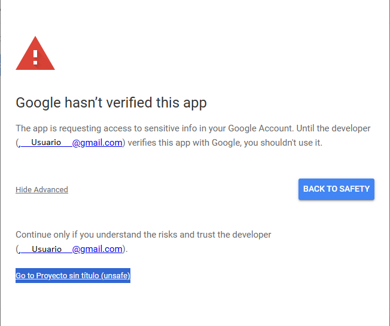
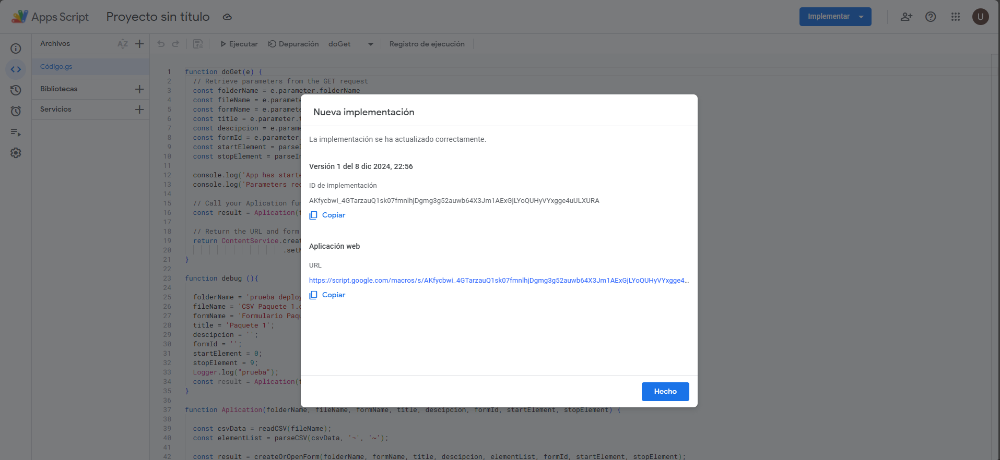
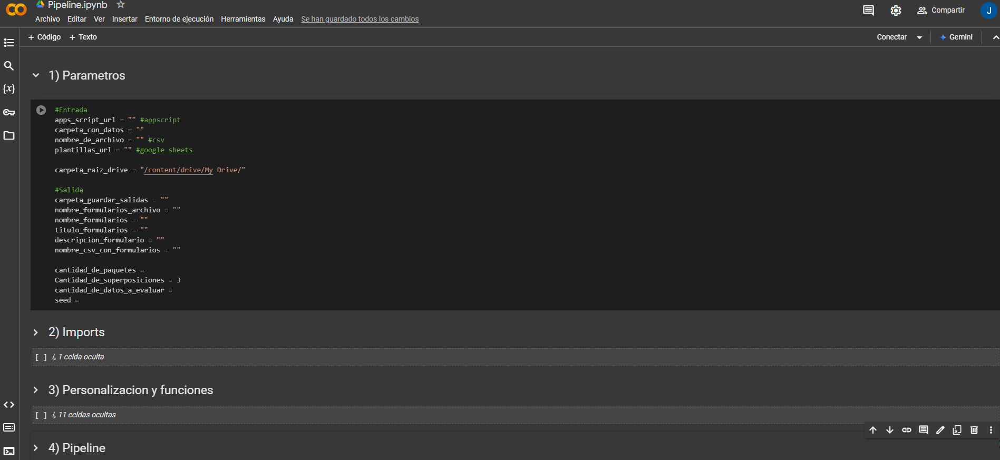
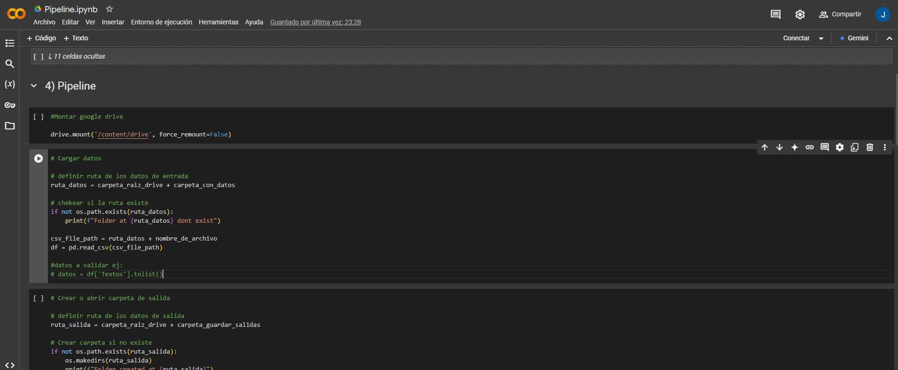

# Pipeline para Evaluación de Datos Generados por IA

Este proyecto implementa un pipeline para **crear formularios de manera automática**. Estos formularios son utilizados por expertos de dominio para evaluar datos generados por Inteligencia Artificial. Además, incluye un ejemplo práctico para su uso.

---

## Descripción

### Datos de Entrada
- **Fuente de datos:** Se espera que los datos estén almacenados en **Google Drive**, en formato **CSV**.
- **Plantillas:** Se requiere una plantilla para definir los elementos y el orden del formulario. Estas plantillas deben estar en un documento de **Google Sheets**. Una plantilla base está incluida en el repositorio `Plantillas_base.xlsx` o tambien puede ser copiada desde google drive ([plantilla](https://docs.google.com/spreadsheets/d/1yl5lK5cGzug3yfYEGMTln4CMZOXq02QuPy-ypOfnOEU/edit?usp=sharing))

### Flujo de Trabajo
1. Configuración de un proyecto en Google Apps Script.
2. Rellenar datos basicos en Google Colab.
3. Personalización opcional del formulario según los requerimientos.
4. Generación de formularios listos para distribuir a los evaluadores.

---

## Instrucciones de Instalación y Ejecución

### 1. Configuración de Google Apps Script
1. Abre el archivo `AppsScript.js` del repositorio o abre el [proyecto compartido](https://script.google.com/d/1u8th30fFVn_hVTFRnDdnn-CFR5B16ZYIMiM_Xka4Bz9IwwgWx5l8Ht4W/edit?usp=sharing).
2. Ve a [Google Apps Script](https://script.google.com/home).
3. Crea un nuevo proyecto:
   - Haz clic en "Nuevo proyecto".  
     
   - Copia y pega el contenido de `AppsScript.js` en el editor.  
     
     
4. Guardar el proyecto:
   
   
5. Implementa el proyecto:
   - Haz clic en **Implementar** y selecciona **Nueva implementación**.  
     
   - Configura los siguientes parámetros:
     - **Tipo:** Aplicación web  
       
     - **Descripción:** Ej. "Creación de Formulario"
     - **Ejecutar como:** Tú mismo (el usuario actual).
     - **Acceso:** Cualquier usuario.  
       
   - Haz clic en **Implementar**, Seguramente google solicitara permisos para el acceso:  
     
   - Luego Google Le solicitara que seleccione el usuario, al seleccionar va a salir una ventana como esta, en la cual hay que ir a avanzado y seleccionar ir al proyecto:
     
     
   - Luego le va a pedir que autorize los persmisos
   - Una vez autorizado deberia salir una ventana con esta, en la cual podemos copiar el URL:
     

### 2. Rellenar datos basicos en Google Colab
1. Abre el notebook de Google Colab asociado al pipeline:  
   .
2. Rellena los campos requeridos en las secciones iniciales del notebook.  
   

### 3. Personalización del Formulario (Opcional)
En la sección **3) Personalización y funciones** del notebook, puedes ajustar el pipeline según tus necesidades:
- Ordenar los elementos de las plantillas.
- Rellenar campos en tiempo de ejecución.
- Cambiar el formato de los paquetes de datos.

### 4. Generación de Formularios
Primero hace falta seleccionar una columna de los datos a utilizar, o  varias columnas en caso de haber personalizado el pipeline

Luego si se puede ejecutar completa la sección **4) Pipeline** para generar los formularios. Al finalizar, obtendrás un archivo **CSV** con los formularios listos para ser asignados a los evaluadores.

---

## Ejemplo de Uso
Se incluye un ejemplo práctico en el notebook de Google Colab para mostrar el flujo completo, desde la configuración inicial hasta la generación final de los formularios.

---

## Contribuciones
Las contribuciones son bienvenidas. Si deseas mejorar este pipeline, por favor abre un **issue** o envía un **pull request**.

---

## Licencia
Este proyecto está bajo la licencia MIT. Consulta el archivo `LICENSE` para más detalles.

---

## Autor
Desarrollado por **[Juan Cruz Oviedo]**.

